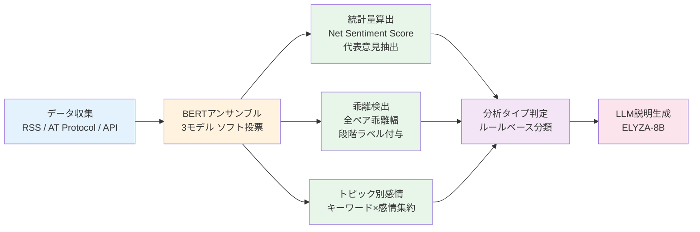
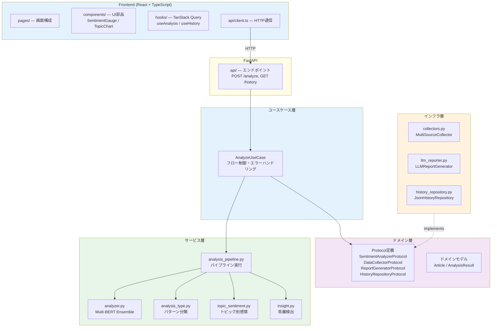

# 🔭 TrendVista AI（トレンドヴィスタ AI）

**多角的な視点から「世の中の空気感」を読み解くAIインサイト抽出ツール**

Googleニュース、BlueSky、はてなブックマークを横断し、メディアの報道トーンと世論の乖離をローカルLLMで分析する。React(TypeScript) + FastAPI構成のフルスタックアプリケーション。


## Overview

TrendVista AIは、任意のキーワードに対して3つの情報源から「空気感」を抽出し、その温度差を可視化するツールである。

| ソース | 性質 | 取得方法 |
|--------|------|----------|
| Googleニュース | メディア報道（公式見解） | RSS |
| BlueSky | SNSの生の声（感情） | AT Protocol |
| はてなブックマーク | ナレッジ層の批判的視点 | 公開API |

すべての処理はローカルで完結し、外部APIへのデータ送信は行わない。

## Key Features

- **定量的な感情分析パイプライン**
  - 複数BERT日本語モデルのアンサンブル（ソフト投票）で各記事・投稿をスコアリング
  - 単一モデル依存を排除し、異なる学習データで訓練されたモデルの合意で判定
  - ソースごとにNet Sentiment Score（positive比率 − negative比率、範囲: -1.0〜+1.0）を算出
- **ソース間乖離の定量検出**
  - 全ソースペア（メディア×SNS×はてブ）の乖離幅を自動計算
  - 段階ラベル（大差なし / やや差あり / 明確な意見差 / 構造的乖離）でギャップの深刻度を明示
- **トピック別感情分析**
  - キーワード単位で感情を集約し、どの話題がポジティブ／ネガティブに寄与しているかを可視化
  - 新モデル追加ゼロ。BERT感情ラベル × Janomeキーワードの掛け合わせで実現
- **分析タイプの自動判定**
  - スコア・乖離値・トピック分布・中立率から分析パターンをルールベースで分類
  - 構造的乖離 / トピック集中型 / 中立支配 / 感情一致 / 混在型の5タイプ
  - トピック集中型は平均±1σの相対評価で判定し、データ量に依存しない安定した分類を実現
- **データドリブンなLLM総評**
  - スコア値・投稿数・乖離幅・トピック感情・分析タイプを事前計算しプロンプトに注入
  - LLMは「分析する」のではなく「データに基づいて説明する」役割に限定
- **代表意見の自動抽出**
  - 各ソースからpositive/negativeの最上位コメントを自動選定
  - ラベルベースのフィルタリングにより、同一コメントの重複表示を防止

## Design Philosophy

1. **LLMに分析させない** — 感情スコア・乖離値・トピック感情・分析タイプはすべてコードで事前計算し、LLMには「説明」のみを担当させる。出力の再現性と検証可能性を確保するため
2. **既存出力の組み合わせで新しい分析を生む** — トピック別感情分析は新モデル追加ゼロで実現。BERT感情ラベル × Janomeキーワードの掛け合わせという最小コストのアプローチ
3. **相対評価で閾値の脆弱性を排除** — 分析タイプ判定のトピック集中型は、固定閾値ではなく平均±1σで判定。データ量やトピック分布が変わっても安定動作する
4. **外部依存ゼロ・ローカル完結** — 有料API不要、データ外部送信なし。個人開発者が継続運用できるアーキテクチャ
5. **ProtocolベースのDIによるテスト容易性** — 具象クラスに依存せず、Protocolインターフェースのみに依存。テスト時はモック注入だけでLLM/ネットワーク/ファイルI/O不要
6. **フロントエンド/バックエンド完全分離** — React SPAとFastAPI間はHTTP APIのみで疎結合。それぞれ独立してデプロイ・スケール可能

## Analysis Pipeline

本ツールの分析は以下の多段パイプラインで構成されており、LLMは最終段の「説明」のみを担当する。



| 処理段階 | 担当 | 出力 |
|----------|------|------|
| 感情スコアリング | BERTアンサンブル（3モデル加重平均） | 各記事のpositive/negative確率 |
| 統計集約 | コード（ルールベース） | ソース別Net Sentiment Score、中立率 |
| 乖離検出 | コード（ルールベース） | ペア別乖離幅 + 段階ラベル |
| トピック別感情 | コード（キーワード×ラベル集約） | 話題単位のNet Sentiment Score |
| 分析タイプ判定 | コード（統計的ルール） | パターン分類 + 判定理由 |
| 代表意見選定 | コード（Top-K抽出） | pos/neg各1件×ソース数 |
| 総評生成 | LLM（ELYZA-8B） | 上記データを引用した説明文 |

## Analysis Type Classification

分析結果に「意味」を付与するルールベースのパターン分類システム。

| タイプ | 条件 | 意味 |
|--------|------|------|
| 🔥 構造的乖離 | 最大乖離 > 0.5 かつ ソース間で評価方向が逆 | メディアと世論で認識が真逆 |
| ⚡ トピック集中型ネガ | トピックスコアが平均 - 1σ未満 | 特定話題がネガティブ文脈で多く出現 |
| 🌟 トピック集中型ポジ | トピックスコアが平均 + 1σ超 | 特定話題がポジティブ文脈で多く出現 |
| ⚪ 中立支配 | 全ソースのneutral > 60% | 明確な評価が少ない（様子見） |
| 🤝 感情一致 | 全ソース同方向 かつ 最大乖離 < 0.2 | 全ソースで意見が一致 |
| 🔀 混在型 | 上記いずれにも非該当 | 複合的な状態 |

## Architecture

React + FastAPIによるフロントエンド/バックエンド分離構成。バックエンドはクリーンアーキテクチャの原則に基づいたレイヤー構成を採用している。



### レイヤー間の依存方向

- **ユースケース層** → Protocol（インターフェース）にのみ依存
- **インフラ層** → Protocolを実装し、具象ライブラリ（collectors, reporter, history）をラップ
- **FastAPI Depends** → 具象クラスを生成してユースケースに注入（Composition Root）

この構成により、テスト時はモック実装を注入するだけで、LLM/ネットワーク/ファイルI/O無しにロジックを検証できる。

## Getting Started

### Prerequisites

- Python 3.12+
- Node.js 22+
- RAM 12GB以上（LLM推論で使用）
- ディスク空き容量 6GB以上（モデルファイルの保存先として必要）

### Docker（推奨）

```bash
cp backend/.env.example backend/.env
docker compose up
```

- Frontend: http://localhost:5173
- Backend: http://localhost:8000
- API docs: http://localhost:8000/docs

### ローカル開発

```bash
# Backend
cd backend
uv sync
cp .env.example .env
uvicorn app.main:app --reload

# Frontend
cd frontend
npm install
npm run dev
```

### Configuration

BlueSky連携を有効にする場合、`backend/.env`ファイルを編集する。

```env
BSKY_HANDLE=yourname.bsky.social
BSKY_PASSWORD=your-app-password
```

BlueSky未設定でもメディア＋はてなブックマークの2ソース分析は動作する。

## API

| Method | Endpoint | Description |
|--------|----------|-------------|
| POST | `/api/analyze` | キーワード分析実行 |
| POST | `/api/report/{id}` | AI総評を生成 |
| GET | `/api/history` | 過去分析一覧 |
| GET | `/api/history/{id}` | 個別分析結果 |
| GET | `/health` | ヘルスチェック |

## Tech Stack

### Backend

| Layer | Technology |
|-------|-----------|
| Web Framework | FastAPI + Pydantic v2 |
| Sentiment Analysis | PyTorch + Transformers（3モデルアンサンブル） |
| Morphological Analysis | Janome |
| LLM Inference | llama-cpp-python + ELYZA-JP-8B (Q4_K_M GGUF) |
| Data Collection | feedparser / atproto / requests |
| Logging | structlog |

### Frontend

| Layer | Technology |
|-------|-----------|
| UI Framework | React 19 + TypeScript |
| Build | Vite 6 |
| Server State | TanStack Query v5 |
| Charts | Recharts |
| Styling | Tailwind CSS |
| Icons | Lucide React |

## Project Structure

```
trend-vista-ai/
├── backend/
│   ├── app/
│   │   ├── api/              # FastAPIエンドポイント
│   │   ├── application/      # ユースケース (AnalyzeUseCase)
│   │   ├── core/             # 設定・DI (config, dependencies)
│   │   ├── domain/           # ドメインモデル・Protocol・例外
│   │   ├── infrastructure/   # アダプター (Collectors, LLM, History)
│   │   ├── schemas/          # リクエスト/レスポンススキーマ
│   │   └── services/         # 分析ロジック
│   │       ├── analyzer.py           # Multi-BERT Ensemble
│   │       ├── analysis_pipeline.py  # パイプライン実行
│   │       ├── analysis_type.py      # ルールベースパターン分類
│   │       ├── topic_sentiment.py    # トピック別感情集約
│   │       ├── insight.py            # 乖離検出
│   │       └── text_processor.py     # 形態素解析・キーワード抽出
│   ├── tests/
│   ├── Dockerfile
│   └── pyproject.toml
├── frontend/
│   ├── src/
│   │   ├── api/client.ts         # APIクライアント
│   │   ├── components/           # SentimentGauge, TopicChart等
│   │   ├── hooks/useAnalysis.ts  # TanStack Query hooks
│   │   ├── pages/                # ページコンポーネント
│   │   └── types/index.ts        # 型定義
│   ├── Dockerfile
│   └── package.json
├── docs/                  # 技術ドキュメント
├── docker-compose.yml
└── .github/workflows/ci.yml
```

## Testing

### Backend

```bash
cd backend

# テスト実行
uv run pytest -x -q

# カバレッジ付き
uv run pytest --cov --cov-report=term-missing

# Lint & Format
uv run ruff check .
uv run ruff format --check .

# Type Check
uv run mypy app/
```

### Frontend

```bash
cd frontend

# Lint
npx eslint .

# Type Check
npx tsc --noEmit

# Build
npm run build
```

### Security Scan (Trivy)

```bash
trivy fs . --scanners vuln,secret,misconfig --severity HIGH,CRITICAL
```

## CI

GitHub Actionsで以下を自動実行している。

| Job | 内容 |
|-----|------|
| backend-lint | Ruff lint + format + mypy |
| backend-test | pytest |
| frontend-lint | ESLint + tsc --noEmit |
| frontend-build | Vite build |
| security-scan | Trivy filesystem scan |

## Documentation

技術的な設計判断や各コンポーネントの詳細は [docs/](docs/) を参照。

| ドキュメント | 内容 |
|-------------|------|
| [docs/ARCHITECTURE.md](docs/ARCHITECTURE.md) | アーキテクチャ設計と_referenceからの移行判断 |
| [docs/DEVELOPMENT_INSIGHT.md](docs/DEVELOPMENT_INSIGHT.md) | 技術設計の背景と意思決定 |
| [docs/tech_sentiment_analysis.md](docs/tech_sentiment_analysis.md) | 感情分析 — BERTアンサンブル |
| [docs/tech_llm_inference.md](docs/tech_llm_inference.md) | LLM推論 — llama-cpp-python + ELYZA |
| [docs/tech_data_collection.md](docs/tech_data_collection.md) | データ収集 — feedparser / atproto / requests |
| [docs/tech_morphological_analysis.md](docs/tech_morphological_analysis.md) | 形態素解析 — Janome |
| [docs/tech_frontend.md](docs/tech_frontend.md) | フロントエンド — React + TanStack Query |
| [docs/testing.md](docs/testing.md) | テスト戦略 |

## License

[MIT](LICENSE)
